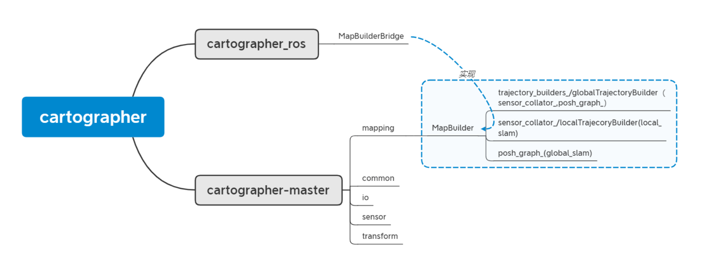

# cartographer

## 1. 基本代码结构：



**mapBuilder:** 实现整个地图的构建，包括前端local slam和后端global slam

**轨迹(trajectory):** 可以理解为一次SLAM从起点到终点过程中的机器人行走轨迹，建图中可以通过startTrajectory和finishTrajectory控制。在轨迹生成的过程中，完成sensor到submap的生成，以及pose_graph的构建。TrajectoryBuilder(globalTrajectory类)主要通过sensor_collator(localTrajectory类)和pose_graph构成。sensor_collator实现局部地图构建，最终结果传递给pose_graph；

**节点图(poseGraph):** 具体参考图优化的知识。简单理解图优化：每个插入的激光和生成的submap，以及landmark都可以理解为图优化的一个节点，建图过程中，生成这些点之间的关系，这些关系便是图中的线，最终优化，就是调整点的位置，得到最优值。可以理解为PoseGraph主要实现全局优化(global slam)功能。

**代码流程:** 最终代码运行通过ROS node方式实现。node中对应topic和service订阅和发布等功能通过MapBuilderBridge类实现。MapBuilderBridge顾名思义，实现ROS节点代码和cartographer功能代码之间的桥接，也可以理解为对cartographer主体代码的接口封装。cartographer主体代码主要功能通过构建地图MapBuilder类实现。此外，MapBuilderBridge还包含sensorBridge类，实现传感信息ros格式和cartographer自定义格式之间的转换，这些传感器主要包括scan，imu，odom，tf等。

MapBuilder类源码注释：

```cpp
//把局部SLAM中的submaps，node等连接起来，形成PoseGraph，以便回环优化
class MapBuilder : public MapBuilderInterFace{ } 
```

**总结: **

整个SLAM过程主要通过TrajectoryBuilder完成，实现sensor到submap的构建，以及pose_graph的构建，最后通过pose_graph实现最终的全局优化(finalOptimization)。

**其他代码说明:**

**mapping:** 实现建图功能

以下四个文件都是mapping中要用到的库函数

common: 时间戳处理，数据统计，参数读取，线程池构建，任务队列等。

io: 读写文件，读写地图，数据类型(proto, pcd, 地图grid)转换等。

sensor: range(激光)，cloud，imu，odom数据类型封装。

transform: 坐标系转换。

## 2. scan处理流程: 

从scan处理过程中理解代码结构。采取至上而下的方式，为了便于理解，以下代码中，删去了大部分源码，仅仅留存我们需要关注的部分。

cartographer_ros/node.cc

```cpp
//ros node 中处理订阅到的激光数据
void Node::HandleLaserScanMessage(const sensor_msg::LaserScan::ConstPtr& msg)
{
    map_builder_bridge_.sensor_bridge(trajectory_id)->HandleLaserScanMessage(sensor_id, msg);
}
```

cartographer_ros/sensor_bridge.cc

```cpp
void SensorBridge::HandleLaserScanMessage(
const std::string& sensor_id, const sensor_msgs::LaserScan::ConstPtr& msg){
    std::tie(point_cloud, time) = ToPointCloudWithIntensities(*msg);
    HandleLaserScan(sensor_id, time, msg->header.frame_id, point_cloud)
    {
        carto::sensor::TimedPointCloud ranges getfrom(points);
        HandleRangefinder(ranges)
        {
            //trajectory_builder_:通过CollatedTrajectoryBuilder实现
            trajectory_builder_->AddSensorData(
            sensor_id, carto::sensor::TimedPointCloudData{
                carto::sensor::TransformTimedPointCloud(ranges)
            })
        }
    }
}
```

cartographer/mapping/internal/collated_trajectory_builder.cc

```cpp
class CollatedTrajectoryBuilder : public  TrajectoryBuilderInterface
{
    void AddSensorData(
    const std::string& sensor_id,
    const sensor::TimedPointCloudData& timed_point_cloud_data) override { AddData(sensor::MakeDispatchable(sensor_id, timed_point_cloud_data));
}
}
```


