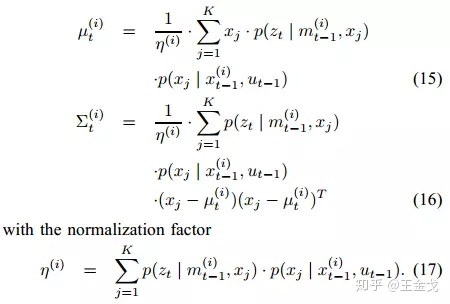
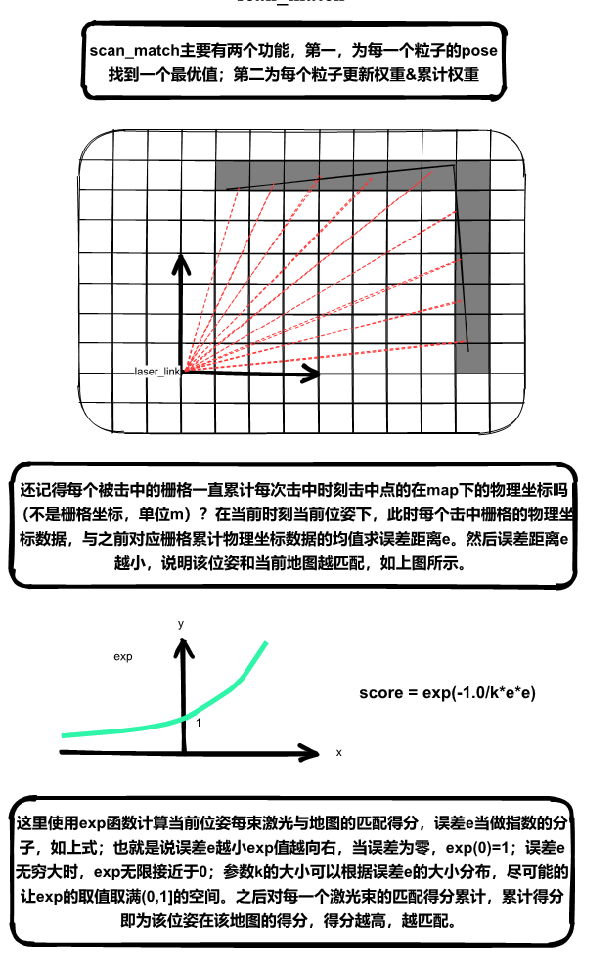
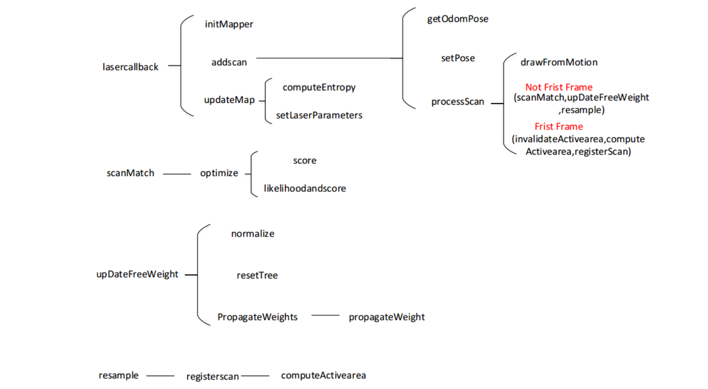

# GMapping学习总结

## 1. Rao-Blackwellized 粒子滤波

在定位问题中，每一个粒子只需要表示一个可能的姿态。但在SLAM中，姿态和地图都是变量，所以一个粒子需要同时保存所有历史时刻的机器人位姿和整个地图。

根据贝叶斯法则，有


这一分解相当于把SLAM分离为定位和建图两步，大大降低SLAM问题的复杂度。该处理方法称为Rao-Blackwellized粒子滤波（RBPF）。

这里通过上一个时刻的地图和运动模型预测当前的位姿，然后计算权重，即在当前位姿下得到当前观测的可能性，再进行重采样，进而更新粒子地图，如此往复。

## 2. 致命缺陷

上面介绍的RBPF方法理论上可行，但是实际却没法用。主要存在两个问题：

- 1. 建图对机器人位姿要求较高的要求，对任意一个粒子，仅仅依靠运动模型采样的结果构建地图，误差会非常大。如果粒子数量足够多，也行会有若干粒子得到准确的地图，但整体上来看，通过运动模型得到的提议分布（proposal distribution）太过于分散，与真实分布相差过大。要想提高真实分布附近的粒子数，就必须整体增加粒子，这会导致计算代价上升。
- 2. 频繁的重采样导致粒子耗散。每个粒子都包含了历史上所有的位姿和地图，频繁的重采样会使历史久远的位姿丧失多样性，因为重采样依赖的权重主要取决于当前观测。

GMapping正是针对这两处缺陷，提出了针对方案。

## 3. 改善方案

### 3.1 针对问题1：改善提议分布

粒子滤波采用里程计运动模型作为提议分布，导致大部分粒子都偏离真实位置。与运动模型相反，激光雷达的观测模型则可以给出一个相对集中的分布。如下图所示，如果把粒子采样范围从又扁又宽的区域更改到激光雷达观测模型所代表的尖峰区域L，新的粒子分布就更贴合真实分布。


**实现方案：**

- 首先按照里程计运动模型给出预测，图1中所有粒子通过里程计运动模型预测出新的位置如图2所示。


- 以图2粒子的预测位置为初始值，对每一个粒子进行一次扫描匹配(scanMatch)。通过扫描匹配得到该粒子的最优位姿如图3，使得当前观测与该粒子所携带的地图最为贴合。


- 得到每个粒子的最优位姿后，再在每个粒子的附近撒播k个粒子，用高斯函数来模拟提议分布如上图4所示，根据这k个粒子的里程计和观测模型来计算高斯分布均值和方差，如下图所示：



- 新的粒子从高斯分布中采样得到


- 此外，对于每个粒子，我们还需要赋予一个权值，以供后续的重采样步骤使用。权重的计算方式如下：


这其实是一个全概率公式，考虑了K个可能出现在当前时刻的位姿，计算它们对当前观测贡献的加权平均。

### 3.2 针对问题2：限制重采样次数

为了避免粒子耗散，作者提出了限制重采样次数的策略。我们可以想象，当机器人持续探索未知区域，并且尚未发生回环的时候，由于针对问题1提议分布的改善，粒子多样性和准确度都维持在一个较高的水平。虽然累积误差始终在叠加，但在局部区域，可以认为粒子保持了较高的精度。此时，如果频繁的执行重采样，粒子的多样性会消失。

何时执行重采样，是一个值得思考的问题。应当明确，重采样的目的是抛弃那些明显远离真实值的粒子，增强那些离真实值近的粒子。如果所有的粒子都在真实值附近，且分布均匀，那么我们就没有理由执行重采样。在回环发生之前，即使有些粒子已经远离了真实值，但现有的观测不足以区分开正确的粒子和错误的粒子，因此这时候重采样是没有意义的。只有在回环发生之后，新的观测彻底拉开正确粒子与错误粒子权重差距，此时重采样才能起到应有的效果。

那么，如何才能知道回环是否发生呢？显然，GMapping没有回环检测的算法，但机智的作者给出了更加巧妙的实现方式。直接通过下式评估所有粒子权重的分散程度。


Neff越大，粒子的权重差距越小。当Neff降低到某一个阈值以下，说明粒子的权重差距较大，即粒子的分布与真实分布差距很大，在粒子层面表现为某些粒子离真实值很近，而很多粒子离真实值较远。这正是回环发生时经常出现的情况，重采样就应该在此时进行。


---

---

## 4. 代码阅读

### 4.1 startLiveSlam()

**从main.cpp进入startLiveSlam函数**

```cpp
/*开始实时SLAM*/
void SlamGMapping::startLiveSlam()
{
    sst_ = node_.advertise<nav_msgs::OccupancyGrid>("map", 1, true);
    sstm_ = node_.advertise<nav_msgs::MapMetaData>("map_metadata", 1, true);
    ss_ = node_.advertiseService("dynamic_map", &MySlamGMapping::mapCallback, this);

    {
        //用message_filters来订阅scan_topic_，进而初始化scan_filter_，
        scan_filter_sub_ = new message_filters::Subscriber<sensor_msgs::LaserScan>(node_, scan_topic_, 5);
        //tf::MessageFilter，订阅激光数据同时和odom_frame之间的转换同步
        scan_filter_ = new tf::MessageFilter<sensor_msgs::LaserScan>(*scan_filter_sub_, tf_, odom_frame_, 5);
        //scan_filter_注册回调函数laserCallback，下面介绍进入回调函数(4.2)
        scan_filter_->registerCallback(boost::bind(&SlamGMapping::laserCallback, this, _1));

        std::cout <<"Start Subscribe LaserScan & odom!!!"<<std::endl;
    }
          
/*发布map到odom的转换关系的线程*/
transform_thread_ = new boost::thread(boost::bind(&SlamGMapping::publishLoop, this, transform_publish_period_));

std::cout <<"Start transform_thread "<<std::endl;
}
    
```

### 4.2 laserCallback()

**从startLiveSlam()进入回调函数laserCallback()**

```cpp
//每当到达一帧scan数据，就将调用laserCallback函数
void SlamGMapping::laserCallback(const sensor_msgs::LaserScan::ConstPtr& scan)
{
    static ros::Time last_map_update(0,0);     //上一次地图更新的时间

    if(!got_first_scan_)                       //如果是第一次接收scan
    {
        if(!initMapper(*scan))                 //初始化地图
            return;
        got_first_scan_ = true;                //改变第一帧的标志位
    }

    GMapping::OrientedPoint odom_pose;         //当前里程计坐标系下的激光雷达位姿的临时变量    
    if(addScan(*scan, odom_pose))                       //进入addScan函数，下面介绍进入addScan函数(4.3)
    {
        std::cout<<"addScan finish"<<std::endl;

        //最优粒子，地图坐标系下的位姿
        GMapping::OrientedPoint mpose = gsp_->getParticles()[gsp_->getBestParticleIndex()].pose;

        //在激光雷达当前位姿下，用当前的里程计坐标系下的激光雷达位姿和map坐标系下的激光雷达位姿，来表述里程计坐标系和map坐标系的差距
        //因为两个坐标系描述的是同一个激光雷达，所以才能用位姿的不同描述坐标系变换关系（差异）
        tf::Transform map_to_lidar  = tf::Transform(tf::createQuaternionFromRPY(0, 0, mpose.theta), 
                                                    tf::Vector3(mpose.x, mpose.y, 0.0));
        tf::Transform odom_to_lidar = tf::Transform(tf::createQuaternionFromRPY(0, 0, odom_pose.theta), 
                                                    tf::Vector3(odom_pose.x, odom_pose.y, 0.0));
        //多个线程访问同一资源时，为了保证数据的一致性，最简单的方式就是使用 mutex（互斥锁）
        //阻止了同一时刻有多个线程并发访问共享资源
        map_to_odom_mutex_.lock();
        map_to_odom_ = map_to_lidar * (odom_to_lidar.inverse()); //表述里程计坐标系和map坐标系的差距 
        map_to_odom_mutex_.unlock();

        //多久更新一次地图
        if(!got_map_ || (scan->header.stamp - last_map_update) > map_update_interval_)
        {
            updateMap(*scan);
            last_map_update = scan->header.stamp;
            std::cout<<"Updated the map"<<std::endl;
        }
    }
    else
    {
        ROS_DEBUG("cannot process scan");
    }
}
```

### 4.3 addScan()

**从laserCallback()进入addScan()函数**

```cpp
//addScan函数，参数：scan、odom_pose(激光雷达里程计位姿)
//每一帧激光数据，都要通过该函数封装gmapping算法需要的数据格式，并调用核心算法
bool SlamGMapping::addScan(const sensor_msgs::LaserScan& scan, GMapping::OrientedPoint& gmap_pose)
{
  //得到与激光数据的时间戳相对应的里程计位姿gmap_pose
  if(!getOdomPose(gmap_pose, scan.header.stamp))    //  进入getOdomPose函数(4.4)
     return false;
  
  // GMapping wants an array of doubles...
  //Gampping需要一个双精度的数组
  //对一帧激光数据的预处理，对距离小于range_min的数据，最大化
  double* ranges_double = new double[scan.ranges.size()];

  //开始处理
  // If the angle increment is negative, we have to invert the order of the readings.
  //如果角度增量是负的，我们就要颠倒读数的顺序
  if (do_reverse_range_)
  {
    ROS_DEBUG("Inverting scan");
    int num_ranges = scan.ranges.size();
    for(int i=0; i < num_ranges; i++)
    {
      // 对距离小于range_min的数据，最大化
      if(scan.ranges[num_ranges - i - 1] < scan.range_min)
        ranges_double[i] = (double)scan.range_max;
      else
        ranges_double[i] = (double)scan.ranges[num_ranges - i - 1];
    }
  } else 
  {
    for(unsigned int i=0; i < scan.ranges.size(); i++)
    {
      // 对距离小于range_min的数据，最大化
      if(scan.ranges[i] < scan.range_min)
        ranges_double[i] = (double)scan.range_max;
      else
        ranges_double[i] = (double)scan.ranges[i];
    }
  }

  //把ROS的激光雷达数据信息转换为GMapping算法看得懂的形式
  GMapping::RangeReading reading(scan.ranges.size(),
                                 ranges_double,
                                 gsp_laser_,
                                 scan.header.stamp.toSec());
  //释放内存
  delete[] ranges_double;

  //为每一个reading设置里程计位姿
  reading.setPose(gmap_pose);

  //调用gmappig算法进行处理，传入reading
  return gsp_->processScan(reading);  //****************此处进入processScan函数(4.5)*******************
}
//addscan()函数只是将获取到的scan消息作下一步处理，转换成gmapping需要的形式，将处理过的数据传入processScan()函数
```

### 4.4 getOdomPose()

**从addScan()进入getOdomPose()函数**

```cpp
//通过每一帧scan的时间戳，计算出当前里程计坐标系下激光雷达的位姿
bool SlamGMapping::getOdomPose(GMapping::OrientedPoint& gmap_pose, const ros::Time& t)
{
  // Get the pose of the centered laser at the right time
  //centered_laser_pose_.stamp_ = t;
  tf::Stamped<tf::Pose> ident (tf::Transform(tf::creatQurationFromRPY(0, 0, 0), tf::Vector3(0, 0, 0)), t, laser_frame_);
  
  //odom_pose存储输出的里程计坐标系下激光雷达tf::Stamped<tf::Pose>格式的位姿
  tf::Stamped<tf::Transform> odom_pose; 
  try
  {
    //odom_frame_ 目标坐标系
    //ident 传入时间戳和坐标系(laser frame)
    //odom_pose得到该时间戳下的位姿数据
    tf_.transformPose(odom_frame_, ident, odom_pose);
  }
  catch(tf::TransformException e)
  {
    ROS_WARN("Failed to compute odom pose, skipping scan (%s)", e.what());
    return false;
  }

  //通过转化得到OrientedPoint格式的里程计坐标系下的位姿
  double yaw = tf::getYaw(odom_pose.getRotation());
  gmap_pose = GMapping::OrientedPoint(odom_pose.getOrigin().x(),
                                      odom_pose.getOrigin().y(),
                                      yaw);
  return true;
}
```

### 4.5 processScan()

**从addScan()进入processScan()函数**

```cpp
  //********************************这部分比较重要****************************************
  bool GridSlamProcessor::processScan(const RangeReading & reading, int adaptParticles ){
    
    //从reading中获取位姿
    //得到当前激光雷达的里程计位姿
    OrientedPoint relPose=reading.getPose();
    
    //m_count表示这个函数的调用次数，如果是第0次调用，上一次初始化上一次里程计位姿
    if (!m_count){
      m_lastPartPose=m_odoPose=relPose;
    }
    
    //使用运动模型更新所有粒子
    //对于每一个粒子都从运动模型中采样，更新每一个粒子对象存储地图坐标系下的激光雷达的位姿，这里注意是地图坐标系下的坐标
    for (ParticleVector::iterator it=m_particles.begin(); it!=m_particles.end(); it++){
      //对于每一个粒子，将从运动模型传播的激光雷达位姿存放到m_particles[i].pose，即最新的地图坐标系下的激光雷达的位姿
      OrientedPoint& pose(it->pose);
      pose=m_motionModel.drawFromMotion(it->pose, relPose, m_odoPose);
    }
    //这里要区分三个位姿
    //m_particle[i].pose最新的地图坐标系下的激光雷达最优位姿
    //relpose：当前激光雷达的里程计位姿
    //m_odoPose：表示上一次的激光雷达的里程计位姿


    //根据两次里程计的数据，计算出激光雷达的线性位移和角度变化
    OrientedPoint move=relPose-m_odoPose;
    move.theta=atan2(sin(move.theta), cos(move.theta));

    //激光雷达在里程计作用下累计移动线性距离和角度变换，用于判断是否进行核心算法处理
    m_linearDistance+=sqrt(move*move);  //两点之间距离公式
    m_angularDistance+=fabs(move.theta);
    
    //更新上一次的里程计位姿
    m_odoPose=relPose;
    //做返回值使用
    bool processed=false;

    //只有当激光雷达走过一定的距离 或者 旋转一定的角度才处理激光数据 或者 处理第一帧数据
    if (! m_count 
	      || m_linearDistance>m_linearThresholdDistance 
	      || m_angularDistance>m_angularThresholdDistance)
  {
      //拷贝reading的scan数据
      int beam_number = reading.getSize();
      double * plainReading = new double[beam_number];
      for(unsigned int i=0; i<beam_number; i++)
      {
        plainReading[i] = reading.m_dists[i];
      }

      //reading_copy数据用来放在每一个节点，构建地图用
      RangeReading* reading_copy = new RangeReading(beam_number,
                                                                        &(reading.m_dists[0]));

      
      //如果不是第一帧数据
      if (m_count>0)
      {
        /*功能：为每一个粒子，在当前激光雷达位姿下，当前帧激光数据下，求解每个粒子的位姿最优值（策略：爬山，评价机制：得分机制（当前位姿下激光数据和当前地图的匹配程度））
                          求解每个粒子的权重
                          爬山算法：每一层，从不同方向找一个得分最高的一个值，直到出现得分开始下降的地方
                          得分算法：根据当前位姿下的每一帧激光扫描点和地图的匹配程度，对每一个激光点进行计算，累计得分，返回得分
        */
      //进行扫描匹配，得到每个粒子的最优位姿，并且计算粒子得分
      scanMatch(plainReading);  //**************进入sacnMatch函数(4.6)***********
      
      //计算重采样的neff（粒子离散程度）的判断值
	    normalize();

      //重采样
      if(resample(plainReading, adaptParticles, reading_copy))
      {
        //进行重采样之后，粒子的权重又会发生变化，更新归一化的权重
        normalize();
      }
      }
      //如果是第一帧数据，这部分代码省略了...
    else
    {
    }
    
    delete [] plainReading;
 
      m_linearDistance=0;
      m_angularDistance=0;
      m_count++;
      processed=true;
      
    }
    return processed;
  }
```

### 4.6 scanMatch()

**从processScan()进入scanMatch()函数**

```cpp
inline void GridSlamProcessor::scanMatch(const double* plainReading){
  //通过参考帧来搜寻局部最优位姿

  for (ParticleVector::iterator it=m_particles.begin(); it!=m_particles.end(); it++)
  {
    OrientedPoint corrected;
    double score, l, s;
    //爬山算法，score最优位姿的最大匹配得分
    score=m_matcher.optimize(corrected, it->map, it->pose, plainReading);//***调用optimize函数执行盘山算法搜寻局部最优位姿(4.7)***
    
    //用最优位姿替换掉原来的位姿，即更新粒子计算出的激光雷达最优位姿（地图坐标系）
    if (score>m_minimumScore)
    {
      m_particles[i].pose=corrected;
    }

    //输入当前地图和当前最优位姿，遍历激光束累计似然，把累计似然当作该粒子的权重，误差越小，似然越大
    //似然大小，代表权重大小
    m_matcher.likelihoodAndScore(s, l, m_particles[i].map, m_particles[i].pose, plainReading);
    //为每个粒子更新权重和累计权重
    m_particles[i].weight+=l;           //该粒子的权重
    m_particles[i].weightSum+=l;  //该粒子的累计权重，寻找最优粒子用

  }
}
```

### 4.7optimize()

**从scanMatch()进入optimize()函数**

```cpp
//每个粒子调用爬山算法函数，optimize函数对位姿进行适当修改，分为四个方向和两个转向，就是为了得到一个得分更好的位姿，直到得分开始下降才认为，此时的位姿点为，最优位姿点
double ScanMatcher::optimize(OrientedPoint& pnew, const ScanMatcherMap& map, const OrientedPoint& init, const double* readings) const
{
    double bestScore=-1;
    //计算当前位置的得分
    OrientedPoint currentPose=init;
	//score函数求当前激光雷达位姿p，在当前地图的匹配得分，越匹配，位姿得分越高，说明位姿越准确
    //score函数见4.8图解
    double currentScore=score(map, currentPose, readings);
	
    //角度和线性位移步进增量大小
    double adelta=m_optAngularDelta, ldelta=m_optLinearDelta;
	
    //减小搜索步长的次数
    unsigned int refinement=0;
	
    //搜索的方向
    enum Move{Front, Back, Left, Right, TurnLeft, TurnRight, Done};
	//就这样在运动模型的更新的激光雷达位姿基础之上，不断的超不同的方向，一层一层的向上爬，同时进行位姿修改，直到位姿得分出现下降，或者迭代结束
    do
    {
        //如果某一次(currentScore)算出来比上一次(bestScore)差，则有可能是走太多了，要减少搜索步长 这个策略跟LM有点像
        if (bestScore>=currentScore)
        {
            refinement++;//减小搜索步长的次数++
            adelta*=.5;
            ldelta*=.5;
        }
		//初始化bestScore，前面在运动模型的更新的激光雷达位姿基础上计算的得分
        bestScore=currentScore;
        OrientedPoint bestLocalPose=currentPose;
        OrientedPoint localPose=currentPose;

        //把6个方向都搜索一次
        Move move=Front;
        do
        {
			//注意currentPose在这一层循环中并没有改变
            localPose=currentPose;
            switch(move)
            {
                case Front:
                    localPose.x+=ldelta;
                    move=Back;
                    break;
                case Back:
                    localPose.x-=ldelta;
                    move=Left;
                    break;
                case Left:
                    localPose.y-=ldelta;
                    move=Right;
                    break;
                case Right:
                    localPose.y+=ldelta;
                    move=TurnLeft;
                    break;
                case TurnLeft:
                    localPose.theta+=adelta;
                    move=TurnRight;
                    break;
                case TurnRight:
                    localPose.theta-=adelta;
                    move=Done;
                    break;
                default:;
            }
			
            //表示当前的位姿和初始位姿的区别 区别越大增益越小
            double odo_gain=1;

            //如果里程计比较可靠的话
            //那么进行匹配的时候就需要对离初始位姿比较远的位姿施加惩罚
			//差距越大，odo_gain越小，小于1也就产生了惩罚
            if (m_angularOdometryReliability>0.)
            {
                double dth=init.theta-localPose.theta;
				dth=atan2(sin(dth), cos(dth));
				dth*=dth;
                odo_gain*=exp(-m_angularOdometryReliability*dth);
            }
            //同样差距越大，odo_gain越小
            if (m_linearOdometryReliability>0.)
            {
                double dx=init.x-localPose.x;
                double dy=init.y-localPose.y;
                double drho=dx*dx+dy*dy;
                odo_gain*=exp(-m_linearOdometryReliability*drho);
            }
            /*计算得分=增益*score*/
            double localScore=odo_gain*score(map, localPose, readings);
			
            /*如果得分更好，则更新得分，和位姿*/
            if (localScore>currentScore)
            {
                currentScore=localScore;
                bestLocalPose=localPose;
            }
        } while(move!=Done);//结束条件：走完6步
		
        /* 把当前位置设置为目前最优的位置*/
        currentPose=bestLocalPose;
    }while (currentScore>bestScore || refinement<m_optRecursiveIterations);//两者有一个满足条件，都不会结束循环
	
    /*返回最优位置和得分*/
    pnew=currentPose;
    return bestScore;
}
```

### 4.8 score()




---

---

## 5. 源码结构图




---

---

## 6. 参考内容

**参考论文**：http://www2.informatik.uni-freiburg.de/~stachnis/pdf/grisetti07tro.pdf

**参考链接**：https://zhuanlan.zhihu.com/p/58442126

**参考链接**：https://zhuanlan.zhihu.com/p/57566566

**参考链接**：https://blog.csdn.net/zhao_ke_xue/article/details/109712355

**参考链接**：https://blog.csdn.net/zhao_ke_xue/article/details/110702322


